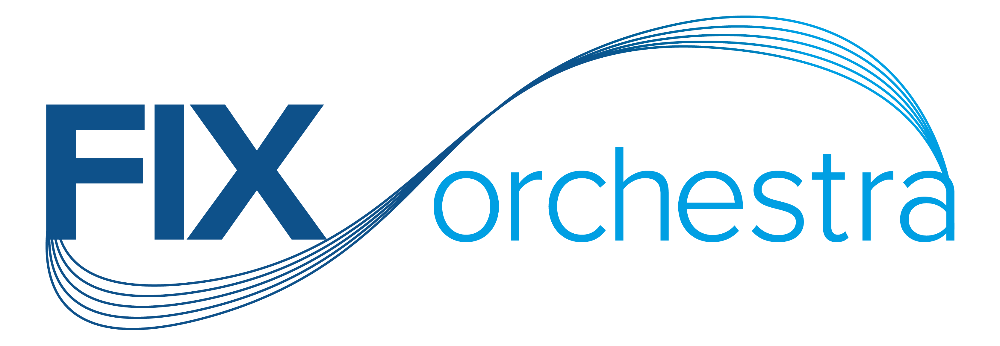

# repository-to-avro



Generates Avro schemas corresponding to the supplied FIX Orchestra repository.

This Avro schema generation creates separate schemas for each FIX *Message*. It is left to the user to decide if they want to create Avro types that ```union``` the *Message* schemas.

Schemas are also generated for each FIX Orchestra ```CodeSet```.

Fields are in-lined, distinct schemas are not generated for each ```Field``` type.

Normalisation of ```Components``` and ```Groups``` in distinct schemas is optional. Where schemas are distinct (normalised) the Avro code generation for Java requires that schema dependencies be imported in the correct order. A schema must be imported before the schema that depends on it.

## Options for Avro schema generation 

|option|required?|description|default|
|------|---------|-----------|-------|
|--orchestra-file|Y|The path/name of the FIX Orchestra file|N/A|
|--output-dir|Y|The output directory|N/A|
|--namespace|Y|The namespace for the generated schema, it is recommended to include a semantic version in the namespace.|N/A|
|--normalise-groups|N|Normalise ```Groups``` by writing the schemas to separate files.|false|
|--normalise-components|N|Normalise ```Components``` by writing the schemas to separate files.|false|
|--append-repo-fix-version-to-namespace|N|Append the FIX protocol version specified in the Orchestra repository file to the namespace|true|
|--avro-standard|N|The value expected in the \"standard\" attribute of the mappedDatatype elements of the Orchestra File|"AvroV1"|

## Customising the Avro schema generation

"Mapped Datatypes" that specify the mapping from FIX datatypes to Avro standard types may optionally be provided in the FIX Orchestra ```datatype``` elements.
Where an Avro ```mappedDatatype``` is not provided for a FIX ```datatype```  then the mapping is derived from the applicable FIX type as specified in the FIX Orchestra repository.

A Mapped Datatype may have an optional ```extension``` element containing the specification of an Avro ```logicalType```. Avro has some standard Logical Types and a user may specify custom Logical Types. See the [Avro specification](https://avro.apache.org/docs/current/spec.html) for details.

## Example Mapped DataTypes

Examples may be found in a [test Orchestra schema](./src/test/resources/trade-latest.xml). These are for demonstration and test purposes only and do not represent advice to use these Avro Mappings nor Avro Logical Types.

### Example ```double``` mapping
```
...
    <fixr:datatype name="Qty" baseType="float" added="FIX.4.2">
        <fixr:mappedDatatype standard="AvroV1" base="double"/>
    </fixr:datatype>
...
```
Resulting type : ```"type": "double"```

### Example ```date``` Logical Type mapping
 ```
 ...
    <fixr:datatype name="UTCDateOnly" baseType="String" added="FIX.4.4">
    <fixr:mappedDatatype standard="AvroV1" base="int">
        <fixr:extension>
            <logicalType name="date"/>
        </fixr:extension>
    </fixr:mappedDatatype>
</fixr:datatype>
...
```
Resulting type : ```{"type": "int", "logicalType": "date"}```

### Example ```decimal``` Logical Type mapping
```
...
    <fixr:datatype name="Price" baseType="float" added="FIX.4.2">
        <fixr:mappedDatatype standard="AvroV1" base="bytes">
            <fixr:extension>
                <logicalType name="decimal">
                    <keyValue key="scale"     value="12"/>
                    <keyValue key="precision" value="4"/>
                </logicalType>
            </fixr:extension>
        </fixr:mappedDatatype>
    </fixr:datatype>
...
```
Resulting type : ```{"type": "bytes", "logicalType": "decimal", "scale": "2", "precision": "4"}```